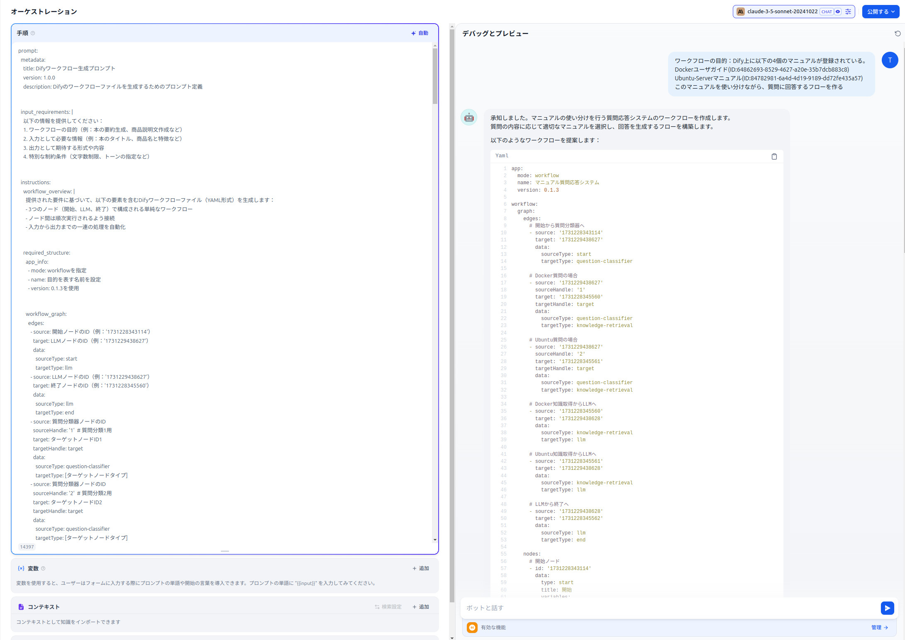
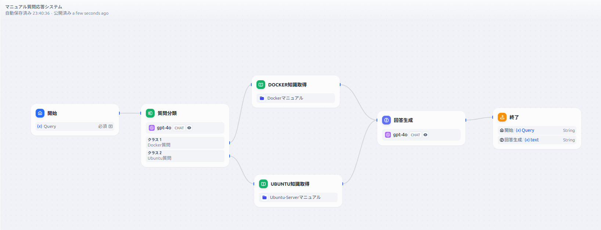

# Dify ワークフロージェネレーター プロンプト

## 概要

このリポジトリは、[Dify](https://dify.ai)のワークフローを生成するためのプロンプト定義を提供します。YAMLフォーマットで記述された詳細なプロンプト仕様に従って、様々なユースケースに対応したワークフローを作成することができます。

## 特徴

- 3つの基本ノード（開始、LLM、終了）による単純なワークフロー生成
- 高度な機能を持つノードタイプのサポート：
  - 質問分類器
  - 知識検索
  - HTTPリクエスト
  - JSONパース
  - IF/ELSEノード
  - codeノード
  - Variable Aggregatorノード

## ファイルの内容

- workflow_generator_prompt.yml
  - ワークフロー生成プロンプトの定義
- dify_chatbot/DifyWorkflowGeneate.yml
  - workflow_generator_prompt.ymlが適用されたDifyのチャットボット
- exampl/manual_search.yml
  - ワークフロー生成の例

## 使用方法

1. git cloneしてください。
```
https://github.com/Tomatio13/DifyWorkFlowGenerator.git
```
2. ワークフロー生成プロンプトdify_chatbot/DifyWorkflowGeneate.ymlをDifyにインポートしてください。
インポートすると以下のような画面になります。


*注意事項*: このプロントは、gpt-4oではなく、claude-3-5-sonnetで実行してください。gpt-4oでは、ワークフローが正しく生成されません。

3. 必要な情報を準備：
   - ワークフローの目的
   - 知識獲得の制御ブロックを利用する場合、ナレッジのdataset_idsを調べて下さい。
        - 調べ方
            ナレッジを含むワークフローを作成してください。
            作成したワークフローのDSLをエクスポートして下さい。
            ```yml
            type: knowledge-retrieval
            title: Ubuntu知識取得
            dataset_ids:
                - 84782981-6a4d-4d19-9189-dd72fe435a57
            retrieval_mode: multiple
            ```
            上記にようにdataset_idsが記述されているのでメモしておいて下さい。

4. 以下の画像のようにプロンプトを作成して実行して下さい。

図のようにDifyにインポート可能なYAMLファイルが生成されます。
5. 生成されたYAMLを別ファイルに貼り付けて、Difyにインポートして下さい。
6. 以下は、example/manual_search.ymlをインポートした画面です。


## サポートされるノードタイプ

### 基本ノード
- 開始ノード：ユーザー入力の受付
  - テキスト入力（短文・段落）
  - 数値入力
  - ファイル入力（ドキュメント、画像、音声、動画）
- LLMノード：OpenAI GPT-4による処理
- 終了ノード：結果の出力

### 拡張ノード
- HTTPリクエストノード：外部API連携
- JSONパースノード：JSON処理
- 質問分類器ノード：入力の分類
- 知識検索ノード：データセットからの情報検索
- IF/ELSEノード：条件分岐
- codeノード：Pythonコードの実行
- Variable Aggregatorノード：複数ノードからの出力を集約
- Document Extractorノード：ドキュメントからのテキスト抽出
- Template Transformノード：テンプレートベースの文字列生成
- Answerノード：応答出力の制御
- Parameter Extractorノード：テキストからのパラメータ抽出

## ワークフロー例

### シンプルな処理フロー
```yaml
開始 → LLM → 終了
```

### 分岐を含むフロー
```yaml
開始 → 質問分類器 → 知識検索 → LLM → 終了
                  → 知識検索 → LLM → 終了
```

### IF/ELSE分岐フロー
```yaml
開始 → IF/ELSE → LLM(True) → 終了
             → LLM(False) → 終了
```

### 変数集約フロー
```yaml
開始 → LLM1 → Variable Aggregator → 終了
    → LLM2 ↗
```

### ドキュメント処理フロー
```yaml
開始(ファイル入力) → Document Extractor → LLM → 終了
```

### テンプレート変換フロー
```yaml
開始 → Template Transform → LLM → 終了
```

### 複合処理フロー
```yaml
開始(ファイル) → Document Extractor → Template Transform → LLM → 終了
```

### 応答制御フロー
```yaml
開始 → LLM → Answer → 終了
```

### 複合応答フロー
```yaml
開始 → LLM1 → Template Transform → Answer → 終了
    → LLM2 ↗
```

### パラメータ抽出フロー
```yaml
開始 → Parameter Extractor → LLM → 終了
```

### 複合パラメータ処理フロー
```yaml
開始 → Parameter Extractor → Template Transform → Answer → 終了
```

## 制限事項

- OpenAIのgpt-4oモデルのみサポート(変更は、Difyの画面上でモデル設定して下さい。)
- codeノードでのboolean型の使用不可（number型で0/1を使用）
- ファイル入力は以下の形式のみサポート：
  - ドキュメント（PDF、Word等）
  - 画像（JPG、PNG等）
  - 音声（MP3、WAV等）
  - 動画（MP4等）
- Template Transformノードの制約：
  - 出力は常にstring型
  - Jinja2テンプレート構文のみサポート
  - 複雑な制御構文は非推奨
- Answerノードの制約：
  - arrayObject型の変数は非対応
  - チャットモードでの特別な動作に注意
  - 変数参照は{{#ノードID.変数名#}}形式のみ
- Parameter Extractorノードの制約：
  - パラメータ名は一意である必要がある
  - 必須パラメータは抽出必須
  - 画像処理は対応モデルのみ使用可能
  - 推論モードはpromptまたはfunction_callのみ
- 未対応のノード:
  - イテレーションノード
  - 変数代入ノード
  - リスト処理
  - ツールノード全般

## ライセンス

MITライセンス

## 貢献について

プルリクエストや課題の報告を歓迎します。

## 関連リンク

- [Dify公式サイト](https://dify.ai)
- [Difyドキュメント](https://docs.dify.ai) 